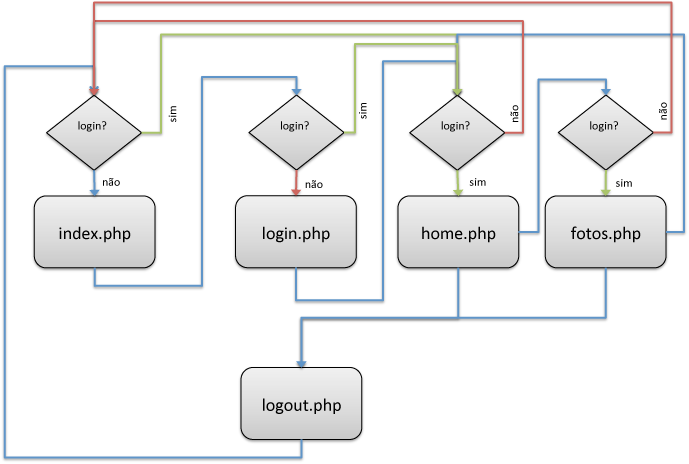

# Sessões PHP
> by pedro miguel moreira - ESTG-IPVC &copy; 2016

## Sessões Web

O protocolo HTTP é um protocolo "stateless". O que isto significa é que o protocolo não tem uma forma intrínseca de manter informação entre duas transações, ou seja, o protocolo não permite ao servidor discernir se dois pedidos foram feitos a partir do mesmo cliente (por exemplo um *browser* num determinado computador).

As sessões são um mecanismo de ultrapassar esta limitação e preservar informação entre acessos subsequentes de um mesmo cliente a um conjunto de páginas.

Uma das aplicações mais comum das sessões é nos sítios web com autenticação. Depois de autenticado (*login*), um utilizador pode aceder a partes do sítio web, inacessíveis de outra forma, ou personalizadas de acordo com um perfil de utilizador. Outras aplicações incluem por exemplo os *cestos de compras* ou a manutenção de uma preferência de idioma.

A informação de sessão persiste entre acessos enquanto a sessão não é destruída (através de um *logout* explícito, de um mecanismo de expiração por tempo, ou do encerramento do *browser*).

A informação associada às sessões não é armazenada fisicamente no computador cliente (ao contrário dos *cookies*). Apenas um identificador único de sessão é mantido pelo *browser*. 

Este identificador pode ser armazenado por um *cookie* ou encapsulado nas mensagens HTTP trocadas entre o cliente e servidor através de parâmetros variáveis GET (tipicamente) ou POST. Toda a restante informação associada à sessão é mantida no servidor.

Embora as sessões possam ser usadas em associação com *cookies*, a possibilidade de o fazerem sem recorrerem ao armazenamento explicito do lado do cliente, é uma vantagem. Note que os *cookies* podem colocar diversos problemas como: não serem suportados ou encontrarem-se desligados em alguns navegadores internet.

Mecanismos mais ou menos idênticos de controlo de sessões são implementadas por diversas linguagens de *scripting* do lado do servidor como sejam o PHP, ASP e JSP.


## Sessões PHP
O controlo de sessões em PHP é relativamente simples de utilizar. Podem-se tipificar um conjunto de operações utilizadas neste controlo:
* início de controlo por sessões
* fechar controlo de sessões
* armazenar informação de sessão
* destruir informação de sessão

### início de controlo por sessão
Qualquer página que faça uso do controlo de sessões PHP terá que invocar `session_start()` antes de qualquer output. Tipicamente `session_start()` é invocado no início dos scripts php.
```php
<?php
session_start();
// (...)
?>
```
Se o pedido HTTP trouxer (por GET, POST ou nos *headers*) um identificador de uma sessão activa, `session_start()` retomará essa sessão. Senão, `session_start()` criará uma nova sessão (com um novo identificador).

Existe também a possibilidade de configurar o PHP para que o controlo de sessões esteja activo por defeito. Este comportamento é configurável a partir da opção `session.auto_start` do ficheiro `PHP.ini`.

### fecho de controlo por sessões
As páginas / scripts que façam uso de uso do controlo de sessões PHP não precisam, na maior parte dos casos, de encerrar o controlo de sessões. Este encerramento é feito implicitamente no momento em que o script termina a sua execução. No entanto, como o  controlo de sessões usa informação que pode ser partilhada entre scripts concorrentes e que usam a mesma informação de sessão (por exemplo pedidos AJAX concorrentes), faz uso de mecanismos de bloqueio (*lock*) de recursos partilhados.

O encerramento explicito do controlo de sessões, o mais cedo possível, liberta logo que possível esses recursos, levando a um melhor desempenho do sistema. O encerramento de sessões é feito por `session_write_close()`. 

A partir do ponto em que é invocado não deve ser usada informação de sessões nesse script.


```php
<?php
session_start();
// (...) código que usa info das sessões
session_write_close();
// a partir daqui não deve ser utilizada informação se sessão
?>
```

### armazenar informação de sessão
A informação de sessão encontra-se acessível a partir da variável global `$_SESSION`. Esta variável é um array associativo. Para criar / aceder a uma variável de Sessão bastará fazer uso de uma chave do array associativo. No exemplo seguinte é registada uma variável `username` de sessão com o valor `zemanel`. (Note que neste caso se a variável já existisse ela seria re-escrita).


As variáveis de sessão não têm um tempo de vida ilimitado. Uma variável de sessão existe até que a sessão seja terminada (`session_destroy()`), a variável seja destruída (*unset*) ou o tempo máximo de vida de uma sessão seja atingido. Este tempo máximo de vida é definido no ficheiro `php.ini` no opção de configuração `session.gc.maxlifetime`. 

```php
<?php
//...
$_SESSION['username'] = 'zemanel';
//...
?
```

As variáveis de sessão são elas próprias muitas vezes utilizadas para saber se a sessão já existia ou acabou de ser criada. 

Assim, se cada vez que uma sessão for criada se registar uma variável de sessão, por exemplo `$_SESSION['activa']`,  torna-se relativamente simples determinar se uma sessão é retomada ou nova, de acordo com exemplo seguinte:

```php
<?php
session_start();
//...
if (isset($_SESSION['ativa']) {
	// sessão foi retomada
	//...
} else {
	// sessão acabou de ser criada
	$_SESSION['ativa'] = true;
	//...
}
// (...)
session_write_close();
?>
```
### destruir informação de sessão

A informação de cada variável de sessão pode ser destruída recorrendo à função `unset()`. Esta forma poderá ser utilizada se pretender destruir seletivamente alguma informação de sessão. 

Para destruir toda a informação associada à sessão pode ser usada a função `session_unset()`. Esta função é equivalente a anular o *array* associativo associado à sessão `$_SESSION = array();`

Para destruir completamente a sessão existente dever-se-à recorrer a `session_destroy()`. Mas antes de invocar `session_destroy()`, deverá fazer `session_unset()` ou `unset()` a todas as variáveis de sessão ainda em utilização.

```php
<?php
session_start();
// destruição seletiva de variáveis de sessão
unset($_SESSION[‘ativa’]);
// mais unsets ...

// ou alteranativamente
// destruição de todas as variáveis de sessão
session_unset();

// destruição da sessão
session_destroy();
?>
```

## Exemplo 1 : Sessões PHP

Este exemplo pretende ilustrar o uso de sessões para personalizar a forma como um utilizador vê um conjunto de páginas. No caso presente, o utilizador pode escolher um de três temas visuais.

### código fonte
O código de suporte a este exemplo encontra-se disponível em [https://github.com/SIR1819/PHP-sessions/PHP-sessions1](https://github.com/SIR1819/PHP-sessions/PHP-sessions1)

### os ficheiros
* `selectX.php`
  * funciona como página de entrada. Caso não exista um tema escolhido: permite escolher o tema. Caso exista: permite aceder a outras páginas ou anular a seleção do tema.
* `form.inc` e `info.inc`
  * código HTML a incluir condicionalmente na página `selectX.php` correspondente à seleção de um tema ou então à navegação e anulação do tema corrente.
* `set.php` 
  * script que faz a seleção do tema (sessões)
* `clear.php` 
  * script que anula a seleção do tema (sessões)
* `content.php` e `content2.php`
  * Páginas adicionais de conteúdos, que serão personalizadas de caordo com o tema selecionado.
* `common.css`
  * folha de estilo comum
* `css{X}.css`
  * folhas de estilo por defeito (X=1) e relativas a cada tema (X=1-3) 


### `selectX.php`
Esta página funciona como ponto de entrada (*home page*) e tem por função permitir a escolha de um tema visual para poder depois aceder às página(s) de conteúdo. Esta informação é armazenada numa variável de sessão.

Esta página varia o seu comportamento e conteúdo conforme exista ou não uma sessão ativa. Assim se existir sessão ativa possui hiperligações para páginas de conteúdo e botão para limpar informação de sessão. 

Se não existir sessão ativa apenas é possível selecionar tema visual. Esta funcionalidade é conseguida à custa de uma inclusão condicional de partes do código HTML na página.

A sessão é considerada ativa se existir um variável de sessão `theme`registada. Essa variável guarda o nome da sessão (1,2, ou 3). Caso não haja sessão ativa considera-se que o nome do ficheiro de estilos a incluir é obtido 

```php
<?php
session_start();

$activeSession=true;

if(!isset($_SESSION['theme'])) {
	$activeSession=false;
}

if($activeSession) {
	// regista a sessao e define css em conformidade
	$theme = $_SESSION['theme'];
	
} else {
	// tema por defeito (sem sessão ativa)
    $theme = '0';
}
$cssfile = "css/css".$theme.".css";
session_write_close();
?>
<html>
<head>
<meta charset="UTF-8"/>
<title>BASIC SESSIONS</title>
<link rel="stylesheet" href="<?php echo $cssfile ?>"></link>
<link rel="stylesheet" href="css/common.css"></link>
</head>
<body>
<?php 
    // se existe uma sessão ativa
	if ($activeSession) 
		include('info.inc'); 
	else 
		include('form.inc');
?>
</body>
</html>
```
### `form.inc` e `info.inc`
O ficheiro `form.inc`contém o código HTML necessário para implementar o formulário de seleção de tema na página gerada por `selectX.php`.

```php
<!-- include file -->	
	<h3> Select a theme </h3>
	<form method="post" action="set.php">
		<label for="itheme1">theme 1 (white)</label>
        <input type="radio" id="itheme1" name="ftheme" value="1" checked="checked">
        
		<label for="itheme2">theme 2 (pink)</label>
        <input type="radio" id="itheme2" name="ftheme" value="2">
        
		<label for="itheme3">theme 3 (green)</label>
        <input type="radio" id="itheme3" name="ftheme" value="3">
        
		<input type="submit" value="SELECT THEME">
	</form>
<!-- end include file -->
```
No caso do acesso a `selectX.php`ter sido feito com um tema (sessão ativa), então o código HTML é substituído por menu de navegação e formulário (botão) para desativar a seleção do tema.

```php
<!-- include file -->
	<h3> A session is set with the following info</h3>
	<form method="post" action="clear.php">
		theme = <?php echo $theme ?>	
		<input type="submit" value="CLEAR THEME">
		<p><a href="content.php">|page 1|</a> - <a href="content2.php">|page 2|</a></p>
	</form>
<!-- end include file -->
```
### `set.php`
Este script efetua a seleção de tema e redireciona para `selectX.php`. Nota: caso já exista uma sessão ativa, então redireciona apara `selectX.php`não anulando a sessão existente. No caso de o pedido chegar sem indicação de uma seleção (por inexistência da variável enviada por POST), então também redireciona para `selectX.php`.

```php
<?php
session_start();

// se nao existe sessão e foi enviada selecao
if(!isset($_SESSION['theme']) && isset($_POST['ftheme'])) {
	// configura informação de sessao (tema)
	$_SESSION['theme'] = $_POST['ftheme'];
}

session_write_close();
header('location:selectX.php');
?>
```

### `clear.php`
Este script anula a seleção de tema (destrói a sessão) e redireciona para `selectX.php`.

```php
<?php
session_start();
session_unset();
session_destroy();
session_write_close();
header('location:selectX.php');
?>
```

### `content.php` e `content2.php`
Ficheiros a simular conteúdos. Redirecionam para `selectX.php`, caso não haja tema / sessão ativos. Abaixo o exemplo para `content2.php`.

```php
<?php
session_start();

// se não existe sessão
if(!isset($_SESSION['theme'])) {
	header('location:selectX.php');
	exit();
}

// se existir
$theme = $_SESSION['theme'];
$cssfile = "css/css".$theme.".css";
session_write_close();

?>

<html>
<head>
<link rel="stylesheet" href="<?php echo $cssfile?>"></link>
<link rel="stylesheet" href="css/common.css"></link>
</head>
<body>
<h3>page 2</h3>

<p><a href="content.php">|page 1|</a> - <a href="selectX.php">|go home|</a></p>
</body>
</html>
```

### `common.css` e `css{X}.css`
Folhas de estilos comuns e específicas de cada tema. Existe um folha css0.css para o tema por defeito e três folhas de estilo css{X}.css para os temas.

No exemplo seguinte a folha de estilos common.css

```css
@CHARSET "UTF-8";
body {
	font-family:Verdana, Geneva, Arial, Helvetica, sans-serif;
}

input[type='submit'] {
	background-color: yellow;
	border-radius: 5px;
}
.copy {
	display: inline-block;
	background-color: #5f8494;
	border-radius: 5px;
	color: lightgrey;
	padding:5px;
}
```

No exemplo seguinte a folha de estilos para css0.css

```css
@CHARSET "UTF-8";
body {
	background-color:silver;
	color:navy;
}
```


## Exemplo 2 : Sessões PHP

**Exemplo das aulas**

Este exemplo pretende ilustrar o uso de sessões para personalizar a forma como um utilizador vê um conjunto de páginas. No caso presente, o utilizador pode escolher um de três temas visuais (lampião- vermelho; dragão - azul; e lagarto - verde)


### código fonte
O código de suporte a este exemplo encontra-se disponível em [https://github.com/SIR1819/PHP-sessions/PHP-sessions2](https://github.com/SIR1819/PHP-sessions/PHP-sessions2)

### funcionamento
O funcionamento do exemplo encontra-se ilustrado na imagem seguinte.

A página `index.php` funciona como ponto de entrada. O utilizador pode escolher uma *identidade* nesta página (equivalente a um *login*). Escolhida a identidade é redirecionado para a página `home.php`. Nesta poderá navegar para a página `fotos.php`que mostra conteúdo de acordo com a identidade escolhida ou então fazer *logout* da identidade escolhida.

Sempre que tente aceder a uma página sem ter uma identidade (*login*) é redirecionado para a página `index.php`. 



### os ficheiros

* `index.php`
  * ponto de entrada. é possível escolher uma de três identidades
* `login.php`
  * regista a identidade escolhida em varíáveis de sessão
* `logout.php`
  * anula o registo (*logout*) da identidade escolhida
* `home.php`
  * página principal de cada utilizador, com conteúdo e uma cor de fundo relativa à identidade escolhida.
* `fotos.php`
  * página de conteúdo, com foto relativa à identidade escolhida.
* pasta `images`
  * contém três imagens `red.jpg`; `green.jpg`e `blue.jpg` que funcionarão como conteúdo exclusivo para cada uma das identidades escolhidas.
